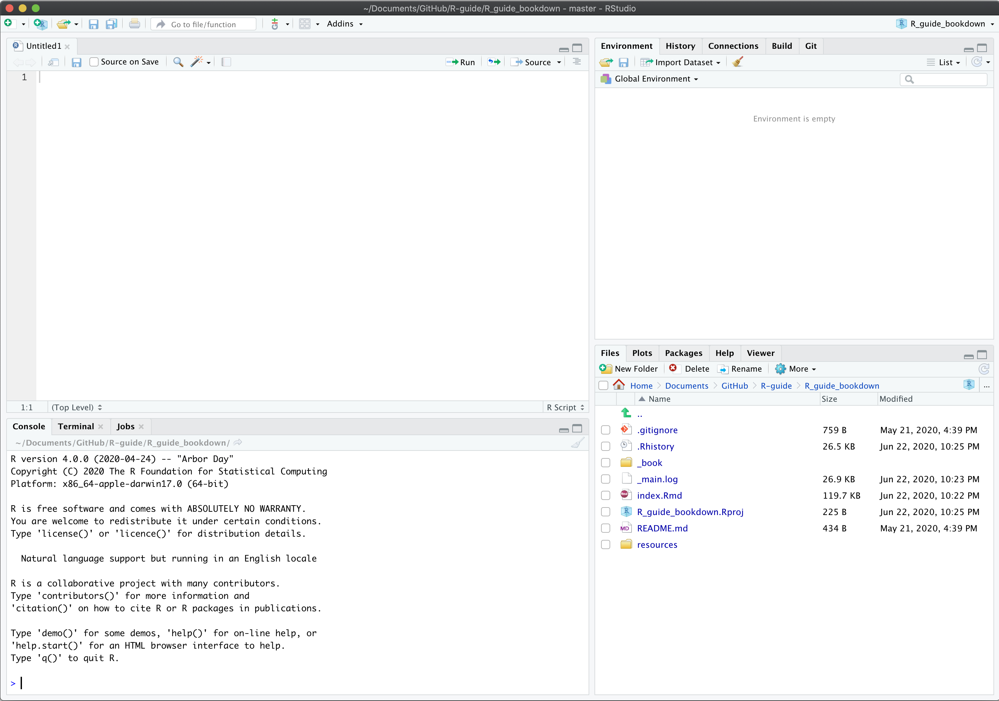
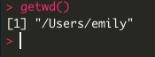
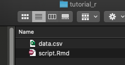
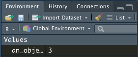

```{r setup, include=FALSE}
knitr::opts_chunk$set(echo = FALSE)
```

## Why R?


## Why R?

-   Flexible
    -   Multiple packages
    -   Multiple functions
    -   Create functions and packages yourself!

## Why R?

-   Data wrangling
    -   Merge datasets
    -   Score questionnaires
    -   Transform scores
    -   Exclude subjects
    -   Group data together

## Why R?

-   Centralize workflow
    -   Clean data
    -   Score data
    -   Analyze data
    -   Create figures
    -   Create tables
    -   Write manuscripts
    -   Create this presentation!

## Why R?

-   Reproducible
    -   No point and click
    -   Publish your code
    -   Re-run your analyses with new data instantly

## Why R?

-   Re-usable
    -   Make your own code repository
    -   Use the same code for multiple studies
    -   Make the same types of figures for multiple datasets

## Basics

## Basics - Software

-   R
    -   Runs in the background
    -   Download [**here**](https://www.r-project.org/)
        -   <https://www.r-project.org/>

-   R-Studio
    -   Where you will do your work
    -   Download [**here**](https://www.rstudio.com/products/rstudio/download/#download)
        -   <https://www.rstudio.com/products/rstudio/download>

## Basics - Environment



## Basics - Creating a script

-   You can type and execute code straight from the console - but to save it and come back to it later, you want to use a script
-   Make a folder on your computer where your data, scripts, and code will live
-   Click: File -> New File -> R Markdown (recommended)

## Programming in R

-   What is a working directory?

{width=50%}

-   Benefits of R Markdown - sets working directory to root folder

{width=50%}

## Programming in R

-   Object-oriented programming
  -   You create objects and store them in the computer's "memory"

```{r objects, echo = TRUE}
an_object <- 2 + 1
an_object
```

-   It also shows up in your environment

{width=50%}

## Programming in R

-   Then you can do other things with it! 
-   Great for complex objects like sets of data.

```{r objects-2, echo = TRUE}
another_object <- 10
sum_of_objects <- an_object + another_object
sum_of_objects
```

## Programming in R - Data Types

- Objects can be more than just numbers
  - Numeric
  -   Integer
  -   Character/String
  -   Logical
  -   Factor
  
```{r data-types, echo = TRUE}
class(sum_of_objects)
```

## Programming in R - Data Structures

- Several but will talk about **Data Frames**
- Let's make our own

```{r data-frame, echo = TRUE}
participant <- as.factor(c(1,2,3,4,5))
sex <- c("Female", "Male", "Male", "Female", "Female")
age <- c(16.5, 21.4, 20.1, 18.2, 17.3)
score_1 <- c(85, 90, 73, 70, 92)
score_2 <- c(87, 89, 85, 88, 97)
my_data_frame <- cbind.data.frame(participant, sex, age, 
                score_1, score_2)
my_data_frame
```

## Programming in R - Data Structures

- Indexing
  - I want to know what my third participant's score_1 was
  - Third participant is in Row = 3 and score_1 is in Column = 4

```{r indexing, echo = TRUE}
my_data_frame[3,4]
```

- Adding variables
  - I want to create a difference score between Score 2 and Score 1 to see if students improved
  
```{r add-variable, echo = TRUE}
my_data_frame$difference <- my_data_frame$score_2 - 
  my_data_frame$score_1
my_data_frame$difference
``` 
  
## Summary Statistics

```{r summary-stats, echo = TRUE}
mean(my_data_frame$age)
range(my_data_frame$age)
levels(my_data_frame$sex)
``` 

## Summary Statistics

```{r summary-stats-grouped, echo = TRUE}
mean(my_data_frame$score_1[my_data_frame$sex == "Female"])
mean(my_data_frame$score_1[my_data_frame$sex == "Male"])
``` 

## Inferential Statistics

- Running inferential statistics in R is surprisingly easy
- Do females in this sample have statistically significantly higher test scores on score 1 than males?

```{r inferential-stats, echo = TRUE}
t.test(my_data_frame$score_1 ~ my_data_frame$sex)
``` 

## Inferential Statistics

- On average, did participants get better from their first score to their second?
- In other words, was the difference between score 2 and score 1 statistically significantly different from 0?

```{r inferential-stats-2, echo = TRUE}
t.test(my_data_frame$difference)
``` 

## Plotting - then a demonstration!

- You will find you may need to install and load "packages" for different uses
- Plotting is a good example

```{r plotting, echo = TRUE, message = FALSE, warning = FALSE}
# Install the needed package 
# (you only need to do this once)
# Note how I've 'commented' this out 
# using hashtags

# install.packages('tidyverse')
library(tidyverse)
``` 

## Plotting - histograms

```{r plotting-2, echo = TRUE, message = FALSE, warning = FALSE, fig.width= 3, fig.height= 2.5, fig.align= 'center'}
ggplot(my_data_frame, aes(x = sex)) +
  geom_histogram(stat = "count") +
  xlab("Sex") + ylab("Count") +
  theme_minimal()
``` 

## Plotting - bar plot

```{r plotting-3, echo = TRUE, message = FALSE, warning = FALSE, fig.width= 3, fig.height= 2, fig.align= 'center'}
ggplot(my_data_frame, aes(x = sex, y = score_1)) +
  stat_summary(fun = mean, geom = "bar") +
  stat_summary(fun.data = mean_cl_normal, 
               geom = "errorbar", width = .2) +
  xlab("Sex") + ylab("Score 1") +
  theme_minimal()
``` 

## R-guide

- Code and simulated data for today's session can be found [**here**](https://github.com/blakemorelab/tutorial_r)
  - https://github.com/blakemorelab/tutorial_r
- I will send around an R-guide with more detailed instructions
  - Please do not distribute the guide as it is a work in-progress

A snippet from the guide:


Thanks Ryan! Lolz

# Now let's do a tutorial with a larger dataset!
